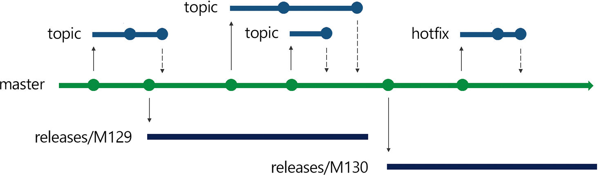

# Snowflake DevOps Framework

## Table of Contents

1. [Overview](#overview)
    1. [SDLC Workflow](#sdlc-workflow)
1. [Environments](#environments)
    1. [Relationship to Snowflake Accounts](#relationship-to-snowflake-accounts)
    1. [Creating Environments](#creating-environments)


## Overview
The purpose of this framework is to provide you with a complete end-to-end DevOps accelerator for Snowflake.

**Please note** that this Snowflake DevOps Framework is a community-developed tool, not an official Snowflake offering. It comes with no support or warranty.

### SDLC Workflow


## Workspace
A workspace is the combination of two things: an identifier (component, business subject area, etc.) and an SDLC environment (dev, test, prod, etc.). This corresponds to how Terraform understands workspaces, see [One Workspace Per Environment Per Terraform Configuration](https://www.terraform.io/docs/cloud/guides/recommended-practices/part1.html#one-workspace-per-environment-per-terraform-configuration) for more details.

### Relationship to Snowflake Accounts
This framework is built around using a single Snowflake account for all environments, as opposed to having a seperate Snowflake account per environment. We decided to start here since it's the most simple and is what most Snowflake customers are doing today. But there are situations where having separate Snowflake accounts per environemt is required or beneficial, and in those cases this framework should be able to be easily adjusted to support.

TOOD: Add diagram


### Creating Environments

### Seeding Environments


## Branching Strategy

There are many different branching strategies to choose from, but we have decided to adopt Microsoft's [Release Flow](https://devblogs.microsoft.com/devops/release-flow-how-we-do-branching-on-the-vsts-team/) branching strategy. The other popular approach today is GitHub's [GitHub Flow](https://guides.github.com/introduction/flow/) branching strategy. Both strategies are great, and both follow a [Trunk Based Development](https://trunkbaseddevelopment.com/) approach which addresses the challenges of long-lived branches and the resulting merge hell. But we feel that Microsoft's Release Flow provides a little more control over release deployment (by not continuously deploying master to production) and aligns a little better with data engineering style releases. At a high level, here are the steps involved:

* The trunk (main or master) is buildable at all times
* All development happens in either topic or hotfix short-lived branches
* All changes in topic or hotfix branches go through code review in a Pull Request (PR)
* Once a topic or hotfix branch is ready to go and has passed all tests the code is immediately merged to the trunk and the branch can be deleted
* Deployments are made to production at the end of each sprint (always from a release branch)
* At the end of each sprint a release branch is created, which only lives during the lifetime of the following sprint
* All deployments to production happen from the release branch, not the trunk
* Hotfixes, like everything else, are made first to a short-lived branch, then merged to the trunk, then cherry picked to the release branch and deployed
* Old release branches can be deleted

And here is a graphical representation from Microsoft's [Release Flow](https://devblogs.microsoft.com/devops/release-flow-how-we-do-branching-on-the-vsts-team/) page:



Here are a few additional resources to help you understand the Release Flow approach:

* [Release Flow: How We Do Branching on the VSTS Team](https://devblogs.microsoft.com/devops/release-flow-how-we-do-branching-on-the-vsts-team/)
* [How Microsoft develops modern software with DevOps](https://docs.microsoft.com/en-us/devops/develop/how-microsoft-develops-devops)
* [Adopt a Git branching strategy](https://docs.microsoft.com/en-us/azure/devops/repos/git/git-branching-guidance?view=azure-devops)


## CI/CD

### Pipelines

### Settings


## Scripts

### Scripts

### Chatops Bots


## Setup
This section will help you get things setup for the Framework.

### Prerequisites

1. Snowflake
    1. **A Snowflake Account.**
    1. **A Snowflake User with `ACCOUNTADMIN` privileges.**
1. GitHub
    1. **A GitHub Account.** If you don’t already have a GitHub account you can create one for free. Visit the [Join GitHub](https://github.com/join) page to get started.
    1. **A GitHub Repository.** If you don't already have a repository created, or would like to create a new one, then [Create a new respository](https://github.com/new). For the type, select `Public` (although you could use either). And you can skip adding the README, .gitignore and license for now.
1. Azure
    1. **An Azure Account with privileges to create resources.**
    1. **The az CLI installed on your computer.** If you don't already have the Azure CLI installed, see the details in their [How to install the Azure CLI](https://docs.microsoft.com/en-us/cli/azure/install-azure-cli) page.
1. Terraform
    1. **Terraform CLI installed on your computer.** If you don't already have the Terraform CLI installed, see the details on their [Install Terraform](https://learn.hashicorp.com/tutorials/terraform/install-cli) page.
1. Integrated Development Environment (IDE)
    1. **Your favorite IDE with Git integration.** If you don’t already have a favorite IDE that integrates with Git I would recommend the great, free, open-source [Visual Studio Code](https://code.visualstudio.com/).
    1. **Your project repository cloned to your computer.** For connection details about your Git repository, open the Repository and copy the `HTTPS` link provided near the top of the page. If you have at least one file in your repository then click on the green `Code` icon near the top of the page and copy the `HTTPS` link. Use that link in VS Code or your favorite IDE to clone the repo to your computer.

### Snowflake
For this Framework you will need to create a service account for Terraform with the appropriate permissions (named `SDF_TERRAFORM_SVC`). We will follow the principles of seperation of duties and least privilege here. The Terraform service account will also be configured to use [Key Pair Authentication](https://docs.snowflake.com/en/user-guide/key-pair-auth.html) with encrypted keys.

Let's begin by creating a role in Snowflake for our Terraform service account along with the required permissions. To start, log in to your Snowflake account and run the following command as the `ACCOUNTADMIN` role:

```sql
USE ROLE ACCOUNTADMIN;

CREATE ROLE SDF_TERRAFORM_ROLE;
GRANT CREATE ROLE ON ACCOUNT TO ROLE SDF_TERRAFORM_ROLE;
GRANT CREATE INTEGRATION ON ACCOUNT TO ROLE SDF_TERRAFORM_ROLE;
GRANT CREATE WAREHOUSE ON ACCOUNT TO ROLE SDF_TERRAFORM_ROLE;
GRANT CREATE DATABASE ON ACCOUNT TO ROLE SDF_TERRAFORM_ROLE;
```

Next we will generate the encrypted private and public keys for our service account. Open a terminal window and run the following:

```bash
openssl genrsa -out snowflake_key 4096
openssl rsa -in snowflake_key -pubout -out snowflake_key.pub
openssl pkcs8 -topk8 -inform pem -in snowflake_key -outform PEM -v2 aes-256-cbc -out snowflake_key.p8
```

Once completed, you will have an encrypted private key file named `snowflake_key.p8` in the PEM format and a public key file named `snowflake_key.pub`. Copy the public and private key files to a local directory for storage. Record the path to the files. Note that the private key is stored using the PKCS#8 (Public Key Cryptography Standards) format and is encrypted using the passphrase you specified in the previous step.

Next, login to your Snowflake account and run the following command as the `ACCOUNTADMIN` role. Please replace the `<RSA PUBLIC KEY HERE>` placeholder with your public key (don't include the BEGIN and END comment lines but do included the newlines):

```sql
CREATE USER SDF_TERRAFORM_SVC RSA_PUBLIC_KEY='<RSA PUBLIC KEY HERE>' DEFAULT_ROLE=SDF_TERRAFORM_ROLE MUST_CHANGE_PASSWORD=FALSE;
GRANT ROLE SDF_TERRAFORM_ROLE TO USER SDF_TERRAFORM_SVC;
```

Finally, test your new service account by connecting to Snowflake via `snowsql` with the following command in your terminal window (replacing the `<>` placeholder values with your real values):

```bash
snowsql -a <account_identifier> -u <user> --private-key-path <path>/snowflake_key.p8
```

### Terraform
Terraform depends on a state file to track the state of the resources/objects being managed. Many declarative style tools like this will do a real-time comparison between the objects defined in code and the deployed objects and then figure out what changes are required. But Terraform does not operate in this manner, instead it maintains a state file to keep track of things. See Terraform's overview of [State](https://www.terraform.io/docs/language/state/index.html) and in particular their discussion of why they chose to require a State file in [Purpose of Terraform State](https://www.terraform.io/docs/language/state/purpose.html).

State files in Terraform introduce a few challenges, the most significant is that the State file can get out of sync with the actual deployed objects. This will happen if you use a different process/tool than Terraform to update any deployed object (including making manual changes to a deployed object). The State file can also get out of sync (or corrupted) when multiple developers/process are trying to access it at the same time. The way to safeguard against that is to use Terraform's [Remote State](https://www.terraform.io/docs/language/state/remote.html) capability to store the state files in a remote backend. To see a list of which backends are supported check out Terraform's [Backends](https://www.terraform.io/docs/language/settings/backends/index.html) page (and the "Standard Backends" in the left navigation of that page). For this framework we will be using the Azure backend `azurerm`. The steps below will walk you through setting this up, but please also see these pages for more details:

* [Terraform's azurerm Backend](https://www.terraform.io/docs/language/settings/backends/azurerm.html)
* [Microsoft's Store Terraform state in Azure Storage](https://docs.microsoft.com/en-us/azure/developer/terraform/store-state-in-azure-storage?tabs=azure-cli)

To create the Azure storage account (which will be used to store the Terraform state files), we will use Terraform! The resource definitions can be found in the `setup/azure-remote-storage.tf` script in this repository. From a terminal window, run the following:

```bash
az login
cd setup
terraform init
terraform apply
```

**TODO** Incorporate best practices for locking down these new Azure resources (storage account)

Since the `setup/azure-remote-storage.tf` script created a storage account with a random 5 character suffix you will need to lookup the storage account name in the [Azure Portal](https://portal.azure.com).

**TODO** Determine the best method of authentication with Azure (Service Principal?)!


## Todos
* Environements
    * Create seeding script/tool
    * Move Terraform scripts into a module like the [Imuta Fast Data Warehouse](https://registry.terraform.io/modules/immuta/fast-data-warehouse/snowflake/latest)
* CI/CD Workflows
    * Add YAML pipelines for other CI/CD tools
* Scripts
    * Move the scripts into a Chatops Bot like [Hubot](https://hubot.github.com/), [Lita](https://www.lita.io/), or [Err](https://github.com/errbotio/errbot)
* Other
    * Add support for dbt


## Maintainers

- Jeremiah Hansen (@sfc-gh-jhansen)

This is a community-developed tool, not an official Snowflake offering. It comes with no support or warranty. However, feel free to raise a GitHub Issue if you find a bug or would like a new feature.


## Legal

Licensed under the Apache License, Version 2.0 (the "License"); you may not use this tool except in compliance with the License. You may obtain a copy of the License at: [http://www.apache.org/licenses/LICENSE-2.0](http://www.apache.org/licenses/LICENSE-2.0)

Unless required by applicable law or agreed to in writing, software distributed under the License is distributed on an "AS IS" BASIS, WITHOUT WARRANTIES OR CONDITIONS OF ANY KIND, either express or implied. See the License for the specific language governing permissions and limitations under the License.
